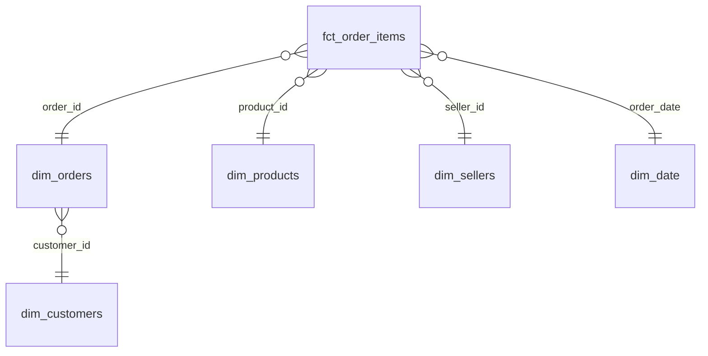

# Olist E-Commerce — Power BI Analytics Dashboard

A Power BI dashboard over the Olist Brazilian e-commerce dataset (~100K orders),
built on a star-schema data model. It answers five business questions spanning
sales performance and supply-chain / delivery operations.

> Status: **in progress** — scope + scaffold complete, data prep next.

## Problem

Olist marketplace stakeholders need a single view to track sales performance and,
just as importantly, **delivery reliability and freight cost** — the operational
levers behind customer satisfaction. This dashboard answers:

1. How do revenue and order volume trend month over month?
2. What is the average actual vs. estimated delivery time, and what share of
   orders arrive late?
3. What is freight cost as a share of order value, by state and category?
4. Which product categories and states drive the most revenue?
5. Does late delivery correlate with lower review scores?

## Dataset

- **Source:** [Olist Brazilian E-Commerce Public Dataset](https://www.kaggle.com/datasets/olistbr/brazilian-ecommerce) (Kaggle) — CC BY-NC-SA 4.0
- **Size:** ~100K orders (2016–2018), 9 CSV files
- Download the CSVs into `data/raw/` (not committed — see `.gitignore`).

## Architecture

Raw CSVs are cleaned and reshaped into a **star schema** by a Python/DuckDB
script (`src/prep_data.py`), which writes tidy fact + dimension tables to
`data/processed/`. Power BI loads the processed tables, applies relationships and
DAX measures, and renders the report.

```
data/raw/*.csv  ──►  src/prep_data.py (DuckDB)  ──►  data/processed/*.csv  ──►  Power BI (.pbix)
```

Star schema:



See [`docs/data_dictionary.md`](docs/data_dictionary.md) for column definitions.

## How to reproduce

```bash
# 1. Create + activate a virtual environment
python -m venv .venv
source .venv/bin/activate          # Windows: .venv\Scripts\activate

# 2. Install dependencies
pip install -r requirements.txt

# 3. Download the Olist CSVs from Kaggle into data/raw/

# 4. Build the star-schema tables
python src/prep_data.py

# 5. Open powerbi/olist_dashboard.pbix in Power BI Desktop and refresh
```

## DAX measures

Documented in [`docs/dax_measures.md`](docs/dax_measures.md). _(added during modeling)_

## Results

_Key findings go here once the report is built — e.g. late-delivery rate, freight
as % of revenue, top category._

## Screenshots

_Add exported PNGs from `screenshots/` here._

<!--  -->
<!--  -->

## Tech stack

Python · DuckDB · pandas · Power BI Desktop · Power BI Service

## License

MIT — see [`LICENSE`](LICENSE). Dataset under CC BY-NC-SA 4.0 (Olist / Kaggle).
